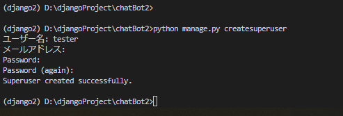

# このアプリケーションはlineのりんなをイメージとしてchatボットがオウム返しする機能を提供しています。


## testコードは「chat」アプリケーションで実装しています。
### テストコードは「chat」アプリケーションのtest.pyをご覧ください。
### 実際にアプリケーションを触ってどんなテストが必要かイメージしながら触って見てください。

# pytestを行う前に行うこと
1. conda create -n 環境名
    * 仮想環境を作成
2. activate 仮想環境名
    * activate化する
3. pip install -r requirements.txt
    * pip listを行い「pytest-django」 がインストールされていることを確認
4. postgreSQLの設定を行う
* 
* * データベース名: chatapp
* * スキーマ名: app
* * python manage.py migrateを実行しデータベース「chatapp」のスキーマ「app」にテーブルが作成されていることを確認
5. chatbot2/settings.pyと同階層にtest_settings.pyファイルがあることを確認
* ここでsetting.pyとteset_settingファイルの違いは?
* * => データベースの接続先をpostgresqlかmemoryにするかの差分
* 
6. manage.py と同階層に「pytest.ini」ファイルがあること
```
    [pytest]
    DJANGO*SETTINGS_MODULE = chatBot2.test_settings
    python_files = test*\*.py
```
* 少し解説
* * DJANGO\*SETTINGS_MODULE = chatBot2.test_settings
* * * 本番時のDBとは別のDBでテストしたい(まっさらなDB（サンドボックス）)ため
* * python_files = test_*.py
* * * test_と命名されているファイルのみをpytestのコマンドを実行したときにテストファイルとしてみなすように設定
* * * 参考: https://self-methods.com/django-pytest-basic/#index_id3
7. スーパーユーザーの作成を行う
* python manage.py createsuperuser
* 
8. runserverする
* python manage.py runserを実行
* http://127.0.0.1:8000/にアクセスし先ほど作成したスーパーユーザーでログインする
9. chatアプリケーションを触ってみる
* 
10. 事前準備が完了

# 参考資料
* [pytestの入門](https://www.amazon.co.jp/%E3%83%86%E3%82%B9%E3%83%88%E9%A7%86%E5%8B%95Python-BrianOkken-ebook/dp/B07F65PFZN/ref=sr_1_2?adgrpid=140889812067&hvadid=651053006122&hvdev=c&hvlocphy=1009132&hvnetw=g&hvqmt=e&hvrand=6292167689686095826&hvtargid=kwd-1676926081362&hydadcr=22032_13455213&jp-ad-ap=0&keywords=%E3%83%86%E3%82%B9%E3%83%88%E9%A7%86%E5%8B%95python&sr=8-2)
* [Tdd com Python](https://www.amazon.co.jp/Tdd-com-Python-Harry-Percival/dp/8575226428)

